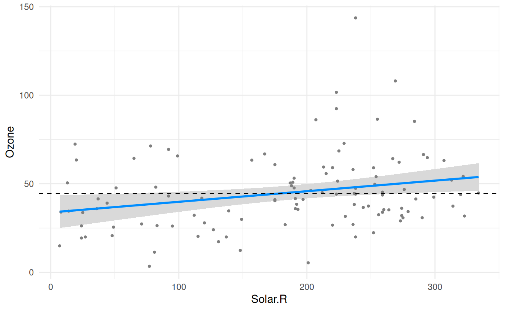
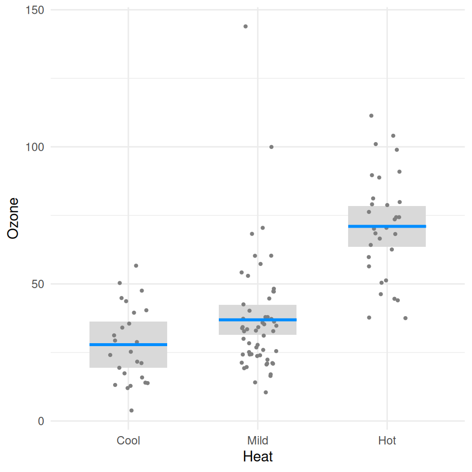

# Getting started

Let’s begin with a simple, additive, linear model:

``` r
fit <- lm(Ozone ~ Solar.R + Wind + Temp, data=airquality)
summary(fit)$coef
#                 Estimate  Std. Error   t value     Pr(>|t|)
# (Intercept) -64.34207893 23.05472435 -2.790841 6.226638e-03
# Solar.R       0.05982059  0.02318647  2.579979 1.123664e-02
# Wind         -3.33359131  0.65440710 -5.094063 1.515934e-06
# Temp          1.65209291  0.25352979  6.516366 2.423506e-09
```

As the summary indicates, temperature has a clear positive effect on
ozone, wind has a clear negative effect, and solar radiation has a more
subtle effect: somewhat positive but could be due to random chance.
Visual summaries are often more informative and clear than numerical
summaries. Let’s see what `visreg` provides:

``` r
visreg(fit, "Wind")
```


The visual summaries reinforce the numeric one: wind has a clear
negative association with ozone. The numeric summary indicates that
solar radiation is just barely significant, which we can see visually
with visreg (adding a horizontal line here that represents the null):

``` r
visreg(fit, "Solar.R")
abline(h=44.5, lty=2)
```



we can see that the gray band just barely excludes a flat line.

All aspects of the above plot (the blue line, the partial residuals, the
band) depend on the specification of not only `Solar.R` but also of all
the other terms in the model. In other words, the result is fully
conditional on all components of the predictor; in `visreg`, this type
of plot is called a *conditional* plot, and it is the default type. By
default, the other terms in the model are set to their median if the
term is numeric or the most common category if the term is a factor.
Changing these defaults is disucssed in
[conditioning](https://pbreheny.github.io/visreg/articles/conditioning.md).

In addition to continuous explanatory variables, `visreg` also allows
the easy visualization of differences between the levels of categorical
variables. The following block of code creates a factor called `Heat` by
discretizing `Temp`, and then visualizes its relationship with `Ozone`:

``` r
airquality$Heat <- cut(airquality$Temp, 3, labels=c("Cool", "Mild", "Hot"))
fit <- lm(Ozone ~ Solar.R + Wind + Heat, data=airquality)
visreg(fit, "Heat")
```


