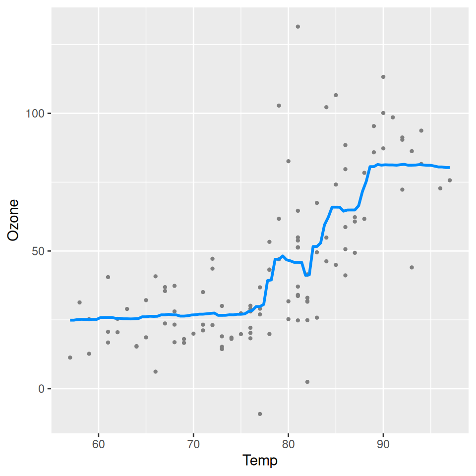
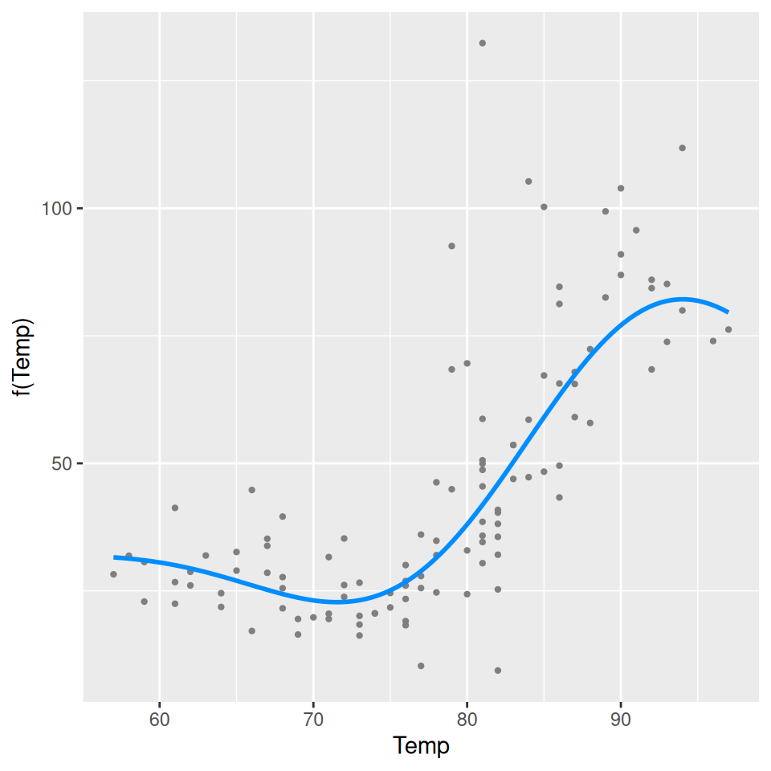
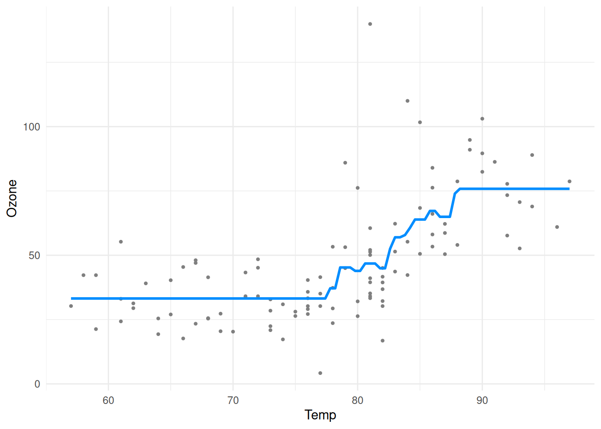
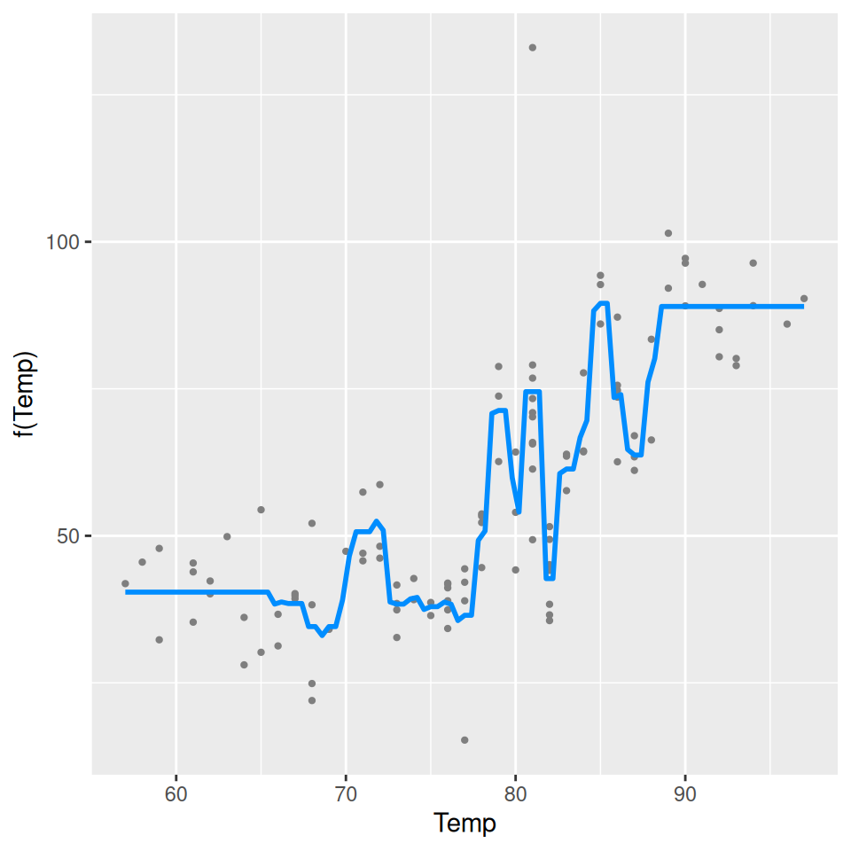

# Forests, SVMs, etc.

As the name implies, `visreg` is primarily designed to visualize
regression models. However, it is also compatible with any formula-based
model class that supplies a `predict` method, which includes models such
as random forests and support vector machines. Such methods are often
thought of as \``black boxes'', but`visreg\` offers a convenient way to
visualize the resulting fit and possibly gain some insight into the
model. Some of these packages do not automatically handle missing data,
so we first create a complete-case data set:

``` r
aq <- na.omit(airquality)
```

## Random forests

``` r
library(randomForest, quietly=TRUE)
fit <- randomForest(Ozone ~ Solar.R + Wind + Temp, data=aq)
visreg(fit, "Temp", ylab="Ozone")
```



## Support vector machines

``` r
library(e1071)
fit <- svm(Ozone ~ Solar.R + Wind + Temp, data=aq)
visreg(fit, "Temp", ylab="Ozone")
```



Note that neither random forests nor support vector machines are able to
provide confidence bands for fitted values, so no shaded bands appear.

## Gradient boosted trees

The implementation of gradient boosted trees in the `gbm` package does
not offer a `residuals` method. This would normally cause `visreg` to
omit plotting the partial residuals. However, we can supply our own
user-defined `residuals` method:

``` r
residuals.gbm <- function(fit) {fit$data$y - fit$fit}
```

This is useful to be aware of in general: if you are ever working with a
model class that does not provide a `residuals` method or a `predict`
method, you can always write your own.

Once defined, we

``` r
library(gbm)
fit <- gbm(Ozone ~ Solar.R + Wind + Temp, data=aq, distribution="gaussian")
visreg(fit, "Temp", ylab="Ozone")
```



Note that the default settings for `gbm` do not produce a very good fit
here. In particular, the default number of trees (100) is too low to
capture the relationship between temperature and ozone. By increasing
the number of trees, we obtain a much more reasonable fit:

``` r
fit <- gbm(Ozone ~ Solar.R + Wind + Temp, data=aq, distribution="gaussian", n.trees=5000)
visreg(fit, "Temp", ylab="Ozone")
```



This is a nice illustration of how visualizing a “black box” method
using `visreg` can provide insight into setting some of the tuning
parameters of these methods.
