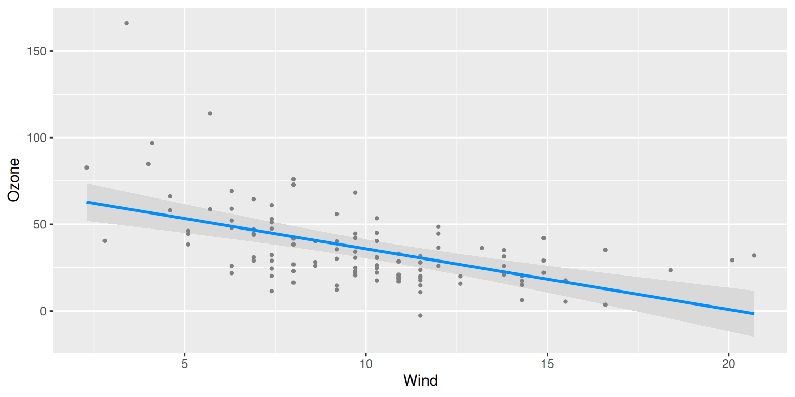
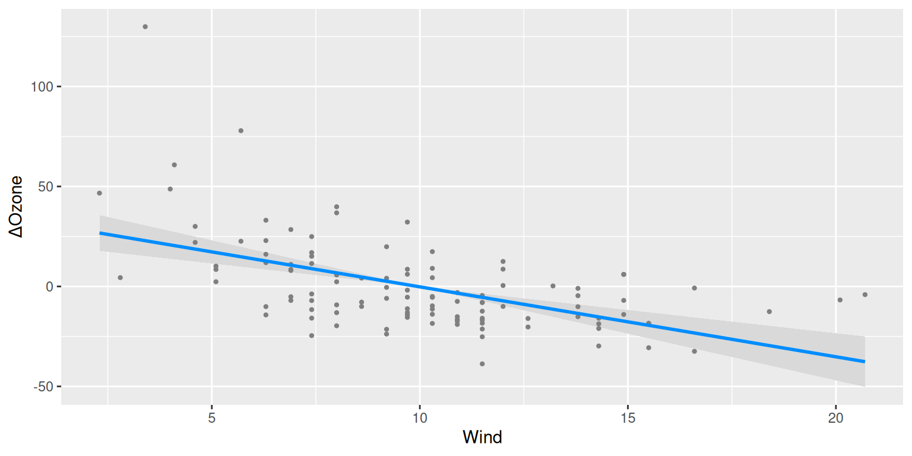

# Contrast vs. conditional plots

Conditional plots were discussed in [getting
started](https://pbreheny.github.io/visreg/articles/basic.md). The
downside of a conditional plot is that all of the terms in the model
must be specified – i.e., to plot the relationship between wind and
ozone, we also need to specify a value for temperature (or use the
median as a default). Specifically, letting x denote the predictor of
interest, y the outcome, and \mathbf{X}\_{-j} the other predictors in
the model, a conditional plot represents the relationship f(x) =
\mathbb{E}(Y \| x, \mathbf{X}\_{-j}).

As an alternative, we could consider relative changes, or as they are
called in statistics, *contrasts*. To be specific, let x_0 denote a
reference value for, e.g., wind, and consider plotting f(x) =
\mathbb{E}(Y \| x) - \mathbb{E}(Y \| x_0). Readers who have taken a
course in regression will recognize that this is one of the defining
characteristics of a *regression* model: a one-unit change in x has the
same effect on \mathbb{E}(Y) regardless of what the other terms in the
model are. Models outside the regression framework, such as [random
forests and support vector
machines](https://pbreheny.github.io/visreg/articles/blackbox.md), do
not have this property, and therefore, may only be visualized with
conditional plots.

To summarize, the primary advantage of a contrast plot is that we don’t
have to specify \mathbf{X}\_{-j}, while the primary disadvantage is that
we have to specify a reference value \mathbf{x}\_0. By default, the
reference value in `visreg` for a numeric variable is its mean, and for
a factor its first, or reference, level.

To see how contrast plots compare to conditional plots, let’s fit the
same model as in [getting
started](https://pbreheny.github.io/visreg/articles/basic.md), but
display contrast plots and conditional plots side-by-side:

``` r
airquality$Heat <- cut(airquality$Temp, 3, labels=c("Cool", "Mild", "Hot"))
fit <- lm(Ozone ~ Solar.R + Wind + Heat, data=airquality)
par(mfrow=c(1,2))
visreg(fit, "Wind", type="conditional")
visreg(fit, "Wind", type="contrast")
```



``` r
visreg(fit, "Heat", type="conditional")
visreg(fit, "Heat", type="contrast")
```



The similarity between the plots is that the slopes of the lines, and
the differences between the levels of `Heat`, are exactly the same in
both plots. However, the vertical axes and the confidence intervals are
different. In particular, the confidence interval for a contrast plot
has zero width at the reference level: we can say with certainty that
\mathbb{E}(Y \| x_0) - \mathbb{E}(Y \| x_0)=0. There is always
uncertainty, however, about the actual value of \mathbb{E}(Y) in a
conditional plot for all values of x. Likewise, at the mean value of
wind, 9.96, the contrast plot passes through 0 by construction, wheras
the conditional plot passes through 34.6.

Furthermore, even where both confidence intervals have nonzero width,
they do not have the same width, because they represent different
things. For example, the width of the confidence interval for `Mild`
heat is wider for the contrast plot than it is for the conditional plot:
there is less uncertainty about the expected value of ozone on a mild
day than there is about the difference in expected values between mild
and cool days.

In these documentation pages, we focus primarily on conditional plots to
avoid duplication, but all of the options and ideas we discuss carry
over to contrast plots as well. It is worth noting, however, that there
are three situations in particular where contrast plots are very useful:

- Logistic regression applied to case-control studies: In such studies,
  the estimation of the intercept parameter is typically meaningless, so
  conditional plots are of questionable value. Contrast plots, however,
  are still meaningful ways to visualize the model’s estimates.
- Cox relative risk (proportional hazards) models: Likewise, in Cox
  models, the baseline hazard is not estimated and plots of absolute
  risk are dubious, but contrast plots still useful.
- [Random effect
  models](https://pbreheny.github.io/visreg/articles/mixed.md): Most
  random effect modeling software cannot account for uncertainty in the
  random effects when calculating standard errors for \mathbb{E}(Y).
  Thus, while conditional plots may still be constructed, they will lack
  confidence intervals. In contrast plots, these terms drop out, and
  confidence intervals may still be constructed.
