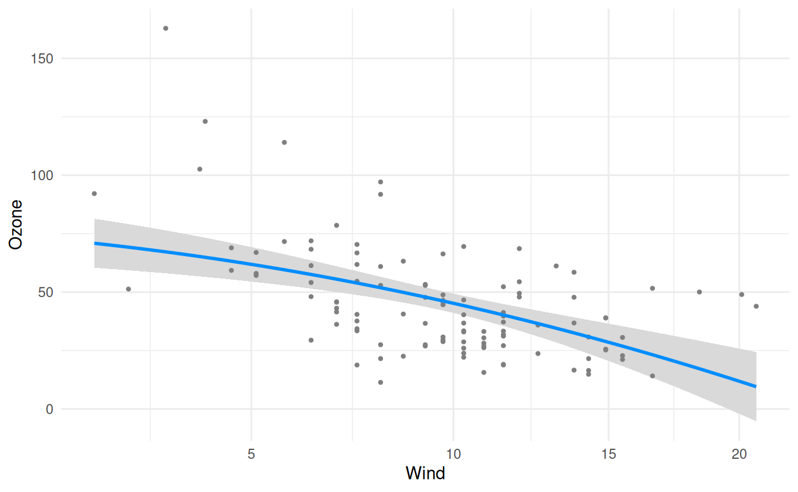

# visreg and ggplot2

By default, `visreg` will use base R graphics as the engine; however,
you also have the option of using `ggplot2` as the engine. For example:

``` r
fit <- lm(Ozone ~ Solar.R + Wind + Temp, data=airquality)
visreg(fit, "Wind", gg=TRUE)
# Warning: `aes_string()` was deprecated in ggplot2 3.0.0.
# ℹ Please use tidy evaluation idioms with `aes()`.
# ℹ See also `vignette("ggplot2-in-packages")` for more information.
# ℹ The deprecated feature was likely used in the visreg package.
#   Please report the issue at <https://github.com/pbreheny/visreg/issues>.
# This warning is displayed once every 8 hours.
# Call `lifecycle::last_lifecycle_warnings()` to see where this warning was
# generated.
# Warning: Using `size` aesthetic for lines was deprecated in ggplot2 3.4.0.
# ℹ Please use `linewidth` instead.
# ℹ The deprecated feature was likely used in the ggplot2 package.
#   Please report the issue at <https://github.com/tidyverse/ggplot2/issues>.
# This warning is displayed once every 8 hours.
# Call `lifecycle::last_lifecycle_warnings()` to see where this warning was
# generated.
```


[Graphical options](https://pbreheny.github.io/visreg/articles/options)
regarding the appearance of points, lines, and bands are specified in
the same way as with base R:

``` r
visreg(fit, "Wind", gg=TRUE, line=list(col="red"),
                             fill=list(fill="green"),
                             points=list(size=5, pch=1))
```


Note that `visreg` returns a `gg` object, and therefore, you can use
`ggplot2` to add additional layers to the graph. For example, we could
add a smoother:

``` r
visreg(fit, "Wind", gg=TRUE) + geom_smooth(method="loess", col='#FF4E37', fill='#FF4E37')
# `geom_smooth()` using formula = 'y ~ x'
```


Or we could modify the theme:

``` r
visreg(fit, "Wind", gg=TRUE) + theme_bw()
```


