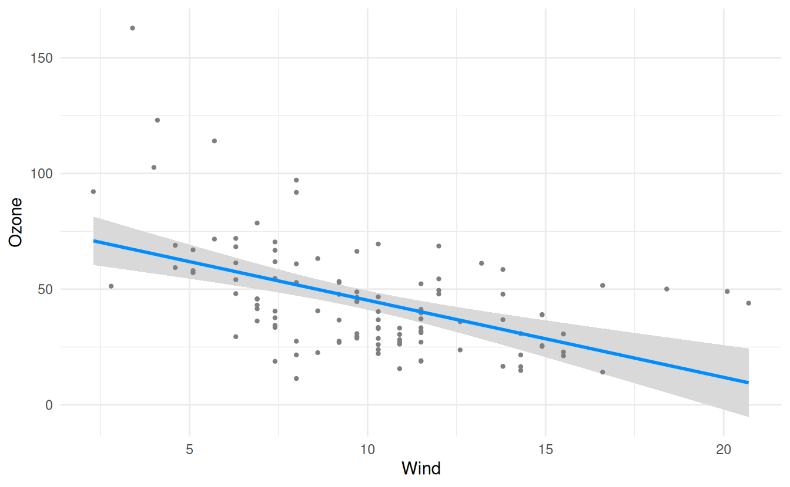
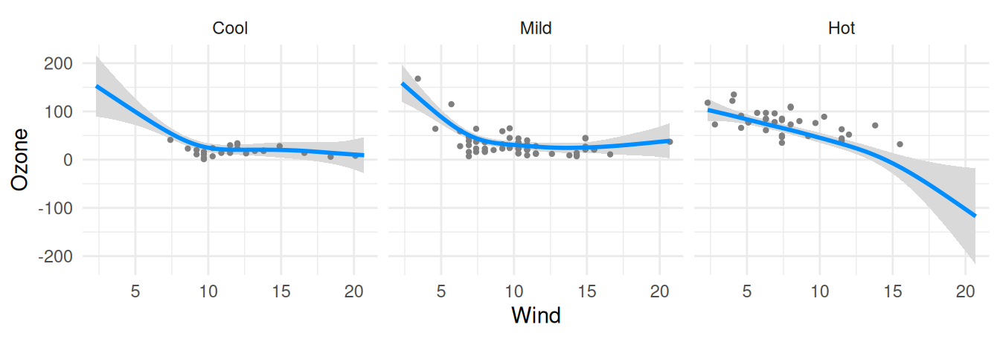

# 

``` r
fit <- lm(Ozone ~ Solar.R + Wind + Temp, data=airquality)
```

and then you pass it to `visreg`:

``` r
visreg(fit, "Wind")
```



A more complex example, which uses the
[`gam()`](https://rdrr.io/pkg/mgcv/man/gam.html) function from **mgcv**:

``` r
library(mgcv)
# Loading required package: nlme
# This is mgcv 1.9-3. For overview type 'help("mgcv-package")'.
airquality$Heat <- cut(airquality$Temp, 3, labels=c("Cool", "Mild", "Hot"))
fit <- gam(Ozone ~ s(Wind, by=Heat, sp=0.1), data=airquality)
visreg(fit, "Wind", "Heat", gg=TRUE, ylab="Ozone")
# Loading required namespace: ggplot2
# Warning: `aes_string()` was deprecated in ggplot2 3.0.0.
# ℹ Please use tidy evaluation idioms with `aes()`.
# ℹ See also `vignette("ggplot2-in-packages")` for more information.
# ℹ The deprecated feature was likely used in the visreg package.
#   Please report the issue at <https://github.com/pbreheny/visreg/issues>.
# This warning is displayed once every 8 hours.
# Call `lifecycle::last_lifecycle_warnings()` to see where this warning was
# generated.
# Warning: Using `size` aesthetic for lines was deprecated in ggplot2 3.4.0.
# ℹ Please use `linewidth` instead.
# ℹ The deprecated feature was likely used in the ggplot2 package.
#   Please report the issue at <https://github.com/tidyverse/ggplot2/issues>.
# This warning is displayed once every 8 hours.
# Call `lifecycle::last_lifecycle_warnings()` to see where this warning was
# generated.
```


