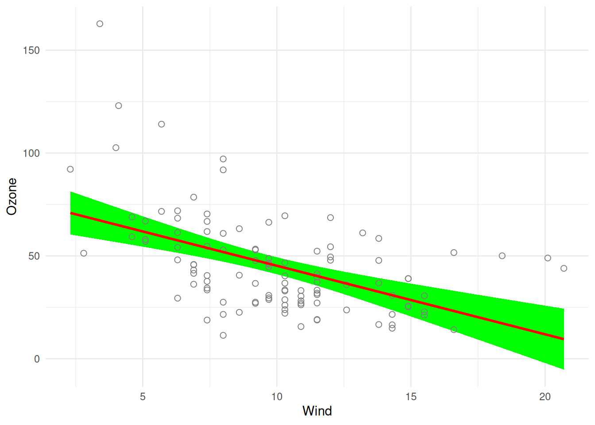

# Migrating to visreg 3.0

    visreg 3.0 includes breaking changes. For migration details, see:
    https://pbreheny.github.io/visreg/articles/migrating-to-3-0.html

Version 3.0 of **visreg** is a breaking release. This article explains
what changed, why, and how to update your code. If you’d rather not
update your code right now, see [Keeping the old
behavior](#keeping-the-old-behavior) below for how to keep using the
pre-3.0 version.

## What changed, and why

**visreg** is old enough that it accumulated three separate plotting
backends over the years: base R graphics, `lattice`, and (added later,
on top of the other two) `ggplot2`. Keeping all three in sync as
features were added became increasingly difficult, and most users only
ever used the `ggplot2` output anyway (via `gg = TRUE`). In 3.0, the
base R and lattice plotting code has been removed entirely:
[`plot.visreg()`](https://pbreheny.github.io/visreg/reference/plot.visreg.md)
now always builds and returns a `ggplot2` object, which you can further
modify with `+`, just as you would any other `ggplot2` plot. The `gg`
argument is gone because there is no longer a choice to make.

At the same time, the package’s internal and user-facing naming was
inconsistent — a mix of `camelCase`, `dotted.names`, and `snake_case`
left over from different eras of the codebase. 3.0 standardizes
everything to `snake_case`. Most of this was internal and invisible to
users, but a handful of user-facing argument names changed as a result
(see the table below). A few arguments that only made sense for the old
lattice/base-R backends (panel spacing, legend toggling) have been
removed, since `ggplot2` handles these automatically. `type = "effect"`,
a deprecated alias for `type = "contrast"` that had been printing a
warning for years, has also been removed for good.

Separately,
[`visreg()`](https://pbreheny.github.io/visreg/reference/visreg.md) is
now stricter about a common source of misleading plots: if you plot the
main effect of a variable that participates in an interaction, without
using `by` or `cond` to address the interaction, `visreg` now always
warns you (previously this only happened in some cases). This isn’t a
rename, but it’s a behavior change worth knowing about if you see new
warnings after upgrading.

## Renamed and removed arguments

| Old (≤ 2.8.1) | New (≥ 3.0) | Where | Notes |
|----|----|----|----|
| `gg` | *(removed)* | [`plot.visreg()`](https://pbreheny.github.io/visreg/reference/plot.visreg.md) | Plots are always `ggplot2` now; there’s nothing to toggle. |
| `line.par` | `line` | [`plot.visreg()`](https://pbreheny.github.io/visreg/reference/plot.visreg.md) |  |
| `fill.par` | `fill` | [`plot.visreg()`](https://pbreheny.github.io/visreg/reference/plot.visreg.md) |  |
| `points.par` | `points` | [`plot.visreg()`](https://pbreheny.github.io/visreg/reference/plot.visreg.md) |  |
| `print.cond` | `print_cond` | [`plot.visreg()`](https://pbreheny.github.io/visreg/reference/plot.visreg.md) |  |
| `strip.names` | `strip_names` | [`plot.visreg()`](https://pbreheny.github.io/visreg/reference/plot.visreg.md) |  |
| `legend` | *(removed)* | [`plot.visreg()`](https://pbreheny.github.io/visreg/reference/plot.visreg.md) | `ggplot2` draws a legend automatically when one is needed; suppress it with `+ ggplot2::theme(legend.position = "none")`. |
| `whitespace` | *(removed)* | [`plot.visreg()`](https://pbreheny.github.io/visreg/reference/plot.visreg.md) | Controlled panel spacing in the old lattice backend; use standard `ggplot2`/[`facet_grid()`](https://ggplot2.tidyverse.org/reference/facet_grid.html) mechanisms if you need to adjust spacing. |
| `xtrans` | *(removed)* | [`visreg()`](https://pbreheny.github.io/visreg/reference/visreg.md) |  |
| `type = "effect"` | `type = "contrast"` | [`visreg()`](https://pbreheny.github.io/visreg/reference/visreg.md), [`visreg2d()`](https://pbreheny.github.io/visreg/reference/visreg2d.md) | The deprecated alias has been fully removed; `contrast` is the only spelling now. |
| `visregList()` | [`visreg_list()`](https://pbreheny.github.io/visreg/reference/visreg_list.md) | top-level function | The function and the S3 class it returns (`"visregList"` → `"visreg_list"`) were both renamed. |

If you were passing any of the old dotted/camelCase names positionally
rather than by name, that will still work — only the names themselves
changed, not the argument order.

## Renamed columns in the returned object

If your code reaches into the object returned by
[`visreg()`](https://pbreheny.github.io/visreg/reference/visreg.md)
directly (rather than just plotting it), note that the columns of the
`fit` and `res` data frames were also renamed to `snake_case`:

| Old              | New               |
|------------------|-------------------|
| `$fit$visregFit` | `$fit$visreg_fit` |
| `$fit$visregLwr` | `$fit$visreg_lwr` |
| `$fit$visregUpr` | `$fit$visreg_upr` |
| `$res$visregRes` | `$res$visreg_res` |
| `$res$visregPos` | `$res$visreg_pos` |

For example:

``` r

fit <- lm(Ozone ~ Solar.R + Wind + Temp, data = airquality)
v <- visreg(fit, "Wind", plot = FALSE)
head(v$fit[, c("Wind", "visreg_fit", "visreg_lwr", "visreg_upr")])
```

       Wind visreg_fit visreg_lwr visreg_upr
    1 2.300   70.88886   60.40958   81.36815
    2 2.484   70.27548   60.01535   80.53561
    3 2.668   69.66210   59.62023   79.70397
    4 2.852   69.04872   59.22417   78.87327
    5 3.036   68.43534   58.82708   78.04360
    6 3.220   67.82196   58.42892   77.21500

## A worked example

Old (2.8.1 and earlier) code that customized the appearance of a plot
might have looked like this:

``` r

visreg(fit, "Wind", gg = TRUE,
  line.par = list(col = "red"),
  fill.par = list(fill = "green"),
  points.par = list(cex = 2, pch = 1)
)
```

The 3.0 equivalent drops `gg = TRUE` (no longer needed) and renames the
three styling arguments:

``` r

visreg(fit, "Wind",
  line = list(color = "red"),
  fill = list(fill = "green"),
  points = list(size = 2, shape = 1)
)
```



Note that the *values* passed to `line`/`fill`/`points` are `ggplot2`
aesthetics (`color`, `size`, `shape`, …), not base R
[`par()`](https://rdrr.io/r/graphics/par.html) names (`col`, `cex`,
`pch`) — this was already true whenever `gg = TRUE` was used pre-3.0, so
it should look familiar if you were already using the `ggplot2` backend.
See [Graphical
options](https://pbreheny.github.io/visreg/articles/options) for
details.

## Still in progress

3.0 is still being finished, and this article will be updated as the
remaining pieces land:

- **Mixed models.** Prediction and standard-error handling for
  `lme4`/`nlme`/`glmmTMB` models is being reworked, and the [mixed
  models article](https://pbreheny.github.io/visreg/articles/mixed)
  hasn’t been updated to reflect the new `predict` argument to
  [`visreg()`](https://pbreheny.github.io/visreg/reference/visreg.md)
  yet (an escape hatch for passing arguments like `re.form` through to
  the model’s own [`predict()`](https://rdrr.io/r/stats/predict.html)
  method). Don’t be surprised if this area continues to change.
- **[`visreg2d()`](https://pbreheny.github.io/visreg/reference/visreg2d.md).**
  The 2D surface-plotting functions are being rethought and, unlike the
  rest of the package, still use the old base R plotting code and naming
  conventions in places. They are not yet part of the ggplot2-only,
  snake_case cleanup described above.

## Keeping the old behavior

If you’re not ready to update your code, you don’t have to: the last
CRAN release before these changes, version 2.8.1, remains available and
can be installed alongside or instead of the current version:

``` r

remotes::install_version("visreg", "2.8.1")
```
