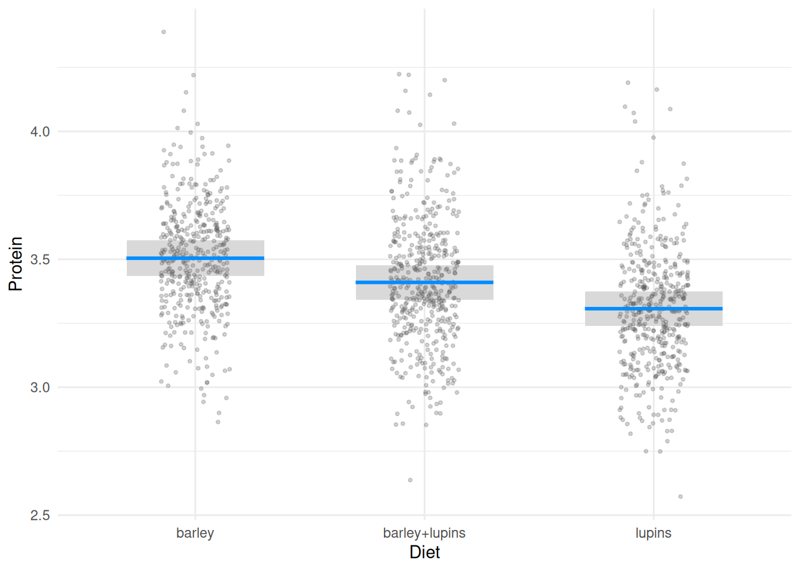
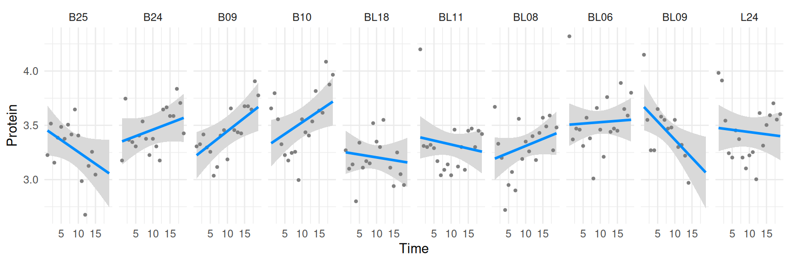
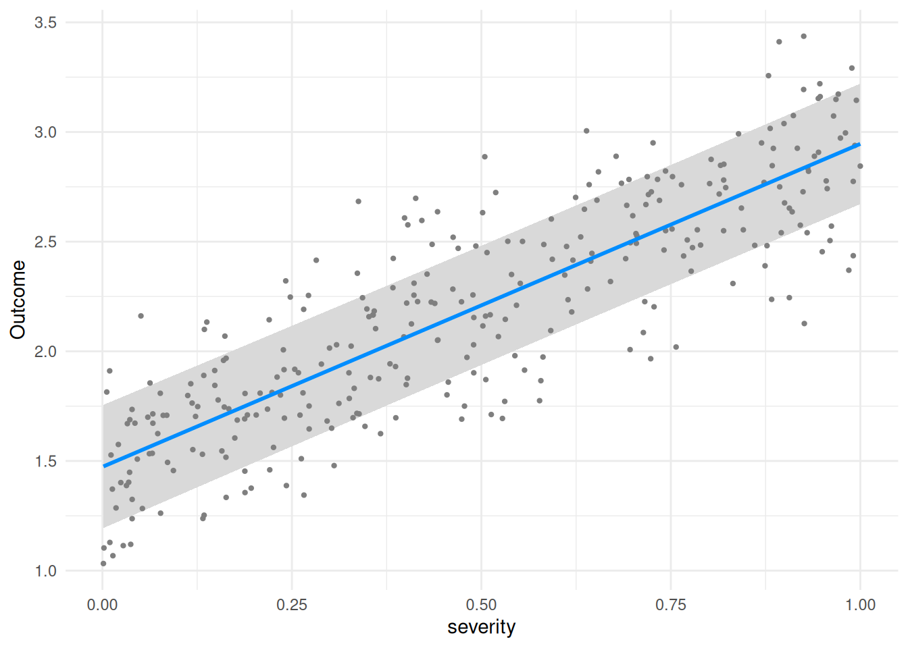

# Mixed models

`visreg` works with mixed models, but how much you get out of a plot
depends on the modeling package. As of `lme4` 1.1-27, `predict.merMod()`
supports `se.fit=TRUE`, so `visreg` can compute real confidence bands
for `lme4` models – this article focuses on `lme4` and shows the three
most useful ways to do that. Other mixed-model packages haven’t caught
up: `nlme`’s `predict.lme()` has no `se.fit` option at all, so plots of
`lme` fits will still lack confidence bands (contrast plots are still
useful there, since the random effects cancel out of a contrast – see
[contrast vs. conditional
plots](https://pbreheny.github.io/visreg/articles/contrast.md)).

The key control for `lme4` models is `re.form`, `lme4`’s own argument
for deciding which random effects to condition on when predicting.
`visreg` passes this through via the `predict` argument (see
[`?visreg`](https://pbreheny.github.io/visreg/reference/visreg.md))
rather than having its own option for it, since it’s specific to how
`lme4` handles prediction.

As an illustration, consider the following random-intercept,
random-slope model from a study involving the protein content of cows’
milk in the weeks following calving:

``` r

library(lme4)
data(Milk, package = "nlme")
ctrl <- lmerControl(optCtrl = list(xtol_rel = 1e-6)) # Warning otherwise
fit <- lmer(protein ~ Diet + Time + (Time | Cow), Milk, control = ctrl)
```

## Population-level effects (the default)

By default, `visreg` predicts with `re.form=NA`: the random effects are
ignored altogether, and the plot shows the fixed-effect
(population-average) relationship, with a confidence band reflecting
uncertainty about the fixed effects only. No extra arguments are needed
for this – it’s what you get by calling
[`visreg()`](https://pbreheny.github.io/visreg/reference/visreg.md)
normally:

``` r

visreg(fit, "Diet", points = list(color = "#55555540", size = 0.75)) +
  ylab("Protein")
```



This is the right choice when you want to describe the typical cow, and
it’s the plot most people want most of the time.

## Conditioning on the estimated random effects

Passing `predict = list(re.form = NULL)` tells `lme4` to condition on
the estimated (BLUP) random effects for whichever cow each row of the
prediction grid belongs to (`NULL` is `lme4`’s own default for
`re.form`, and is equivalent here to spelling out the full
random-effects formula, `re.form = ~ (Time | Cow)`, since `Cow` is the
model’s only grouping factor). Combined with `by`, this lets you plot
cow-specific curves – the fitted relationship between protein and time,
separately for each cow. For the sake of space, we subset the plot to
ten cows rather than all 79; this can be done by returning, then
subsetting, the raw `visreg` object prior to plotting.

``` r

v <- visreg(fit, "Time", by = "Cow", predict = list(re.form = NULL), plot = FALSE)
sub_cow <- sample(levels(Milk$Cow), 10)
vv <- subset(v, Cow %in% sub_cow)
plot(vv) + ylab("Protein")
```



Each cow’s curve now has its own confidence band, but it’s worth being
clear about what these bands represent: they reflect the precision with
which *that cow’s own trajectory* is estimated, given its random
effects, and are a different quantity than the population-level band
above, which reflects uncertainty about the fixed effects for a
“typical” cow.

## Conditioning on some, but not all, random effects

When a model has more than one grouping factor, `re.form` can also be a
formula naming just the grouping factor(s) you want to condition on,
letting you marginalize over the rest. This isn’t an option for the milk
yield model above, which has only one grouping factor (`Cow`) with a
correlated random slope and intercept – asking `lme4` to condition on
just the random intercept via `re.form = ~ (1 | Cow)` actually raises an
error (`non-conformable arguments`), because it can’t split a correlated
slope and intercept apart like that. Partial conditioning only becomes
useful once a model has more than one grouping factor to choose from.

As a small example, suppose patients are seen at different clinics, and
both patients and clinics have their own random intercepts:

``` r

set.seed(1)
n_clinic <- 15
n_patient <- 20
n <- 300
clinic <- factor(sample(1:n_clinic, n, replace = TRUE))
patient <- factor(sample(1:n_patient, n, replace = TRUE))
severity <- runif(n)
b_clinic <- rnorm(n_clinic, sd = 0.5)
b_patient <- rnorm(n_patient, sd = 1)
outcome <- 2 + 1.5 * severity + b_clinic[clinic] + b_patient[patient] + rnorm(n, sd = 0.3)
dat <- data.frame(outcome, severity, clinic, patient)
fit2 <- lmer(outcome ~ severity + (1 | patient) + (1 | clinic), data = dat)
```

Conditioning on clinic random effects while marginalizing over patient
random effects:

``` r

visreg(fit2, "severity", predict = list(re.form = ~ (1 | clinic)),
       cond = list(clinic = levels(clinic)[1])) +
  ylab("Outcome")
```



This differs from both the fully marginal plot (`re.form=NA`, the
default) and the fully conditional one (`re.form=NULL`, conditioning on
both clinic and patient): it isolates the uncertainty coming from
patients, while still reflecting which clinic is being examined.

## Returning the data used in a plot

Returning the data frames, estimates, confidence intervals, and
residuals used in the construction of its plots, as in the
[`subset()`](https://rdrr.io/r/base/subset.html) example above, allows
users to write their own extensions and modifications of `visreg` plots.
