# Graphical options

`visreg` tries to set up pleasant-looking default options, but
everything can be tailored to user specifications. For the plots below,
we work from this general model:

``` r

airquality$Heat <- cut(airquality$Temp, 3, labels = c("Cool", "Mild", "Hot"))
fit <- lm(Ozone ~ Solar.R + Wind + Heat, data = airquality)
```

## Turning on/off plot components

By default, `visreg` includes the fitted line, confidence bands, and
partial residuals, but the residuals and the bands can be turned off:

``` r

visreg(fit, "Wind", band = FALSE)
```

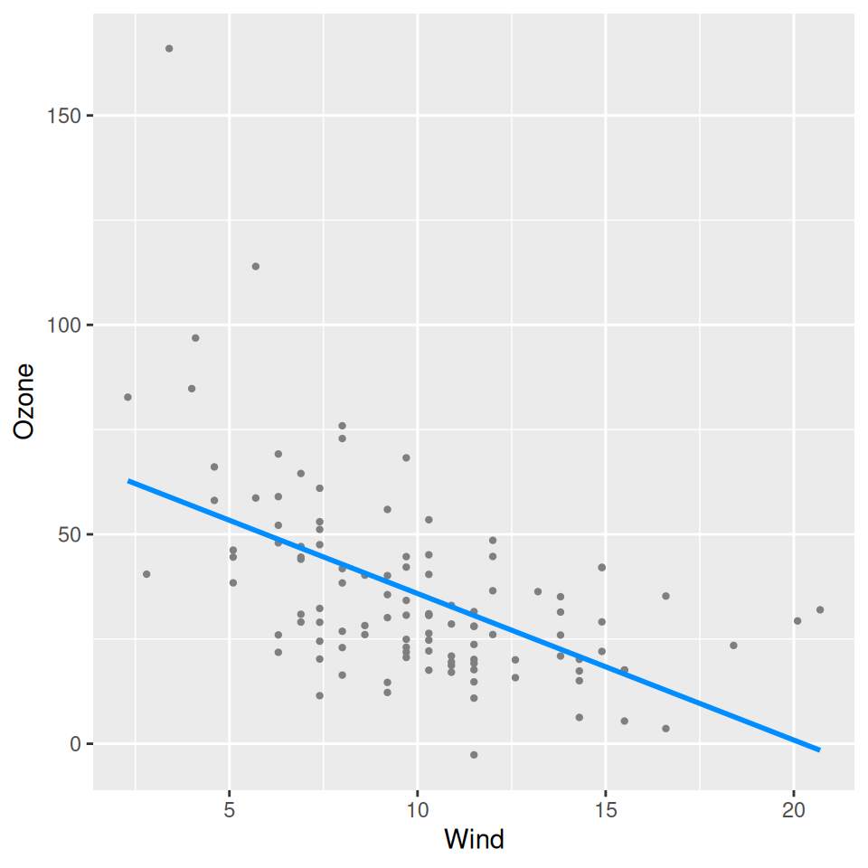

``` r

visreg(fit, "Wind", partial = FALSE)
```


Note that by default, when you turn off partial residuals, visreg tries
to display a rug so you can at least see where the observations are. You
can turn this off too:

``` r

visreg(fit, "Wind", partial = FALSE, rug = FALSE)
```

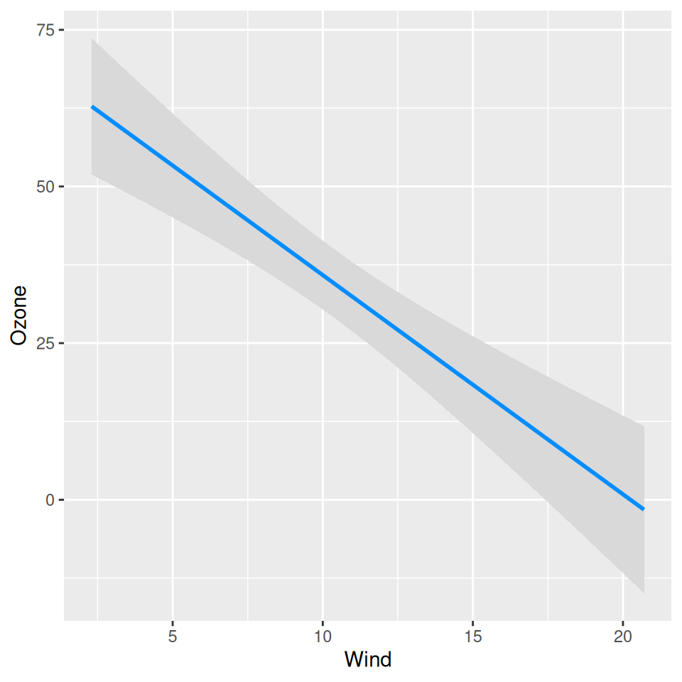

Finally, there is an option for displaying separate rugs for positive
and negative residuals on the top and bottom axes, respectively, with
`rug=2` (this is particularly useful for [logistic
regression](https://pbreheny.github.io/visreg/articles/glm.md)):

``` r

visreg(fit, "Wind", rug = 2, partial = FALSE)
```

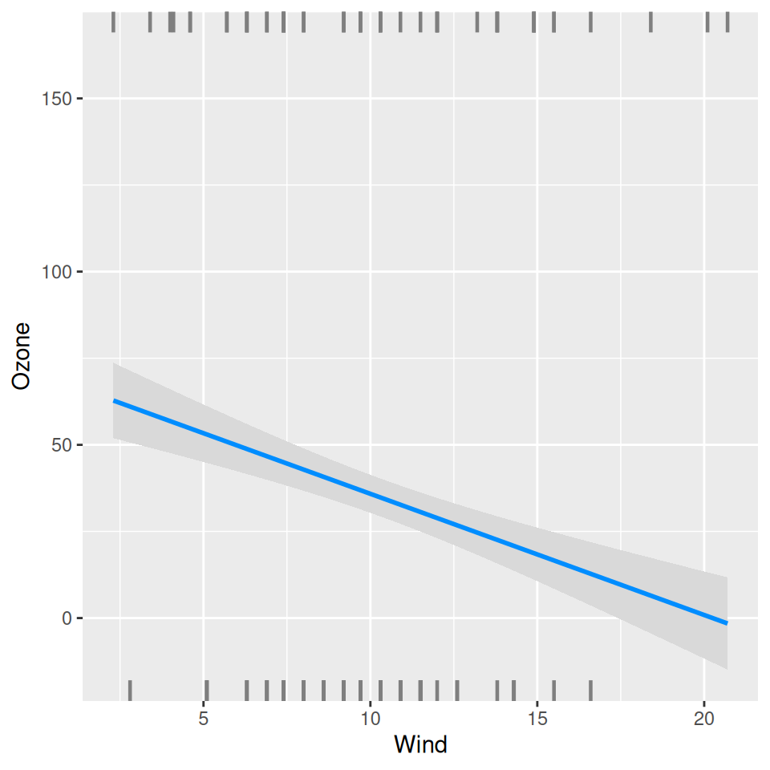

## Jittering

If there are many ties in a numeric variable `x`, jittering can be
helpful way to avoid overplotting:

``` r

fit <- lm(Ozone ~ Solar.R + Wind + poly(Month, 2), data = airquality)
visreg(fit, "Month")
```

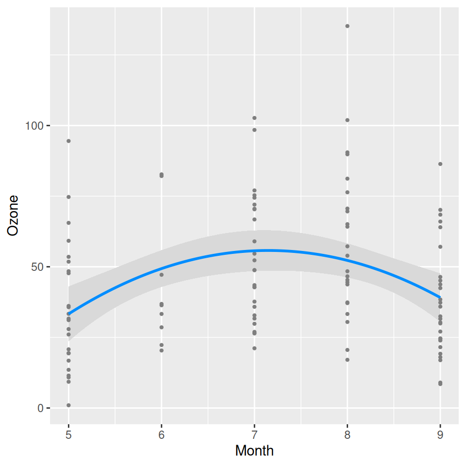

``` r

visreg(fit, "Month", jitter = TRUE)
```

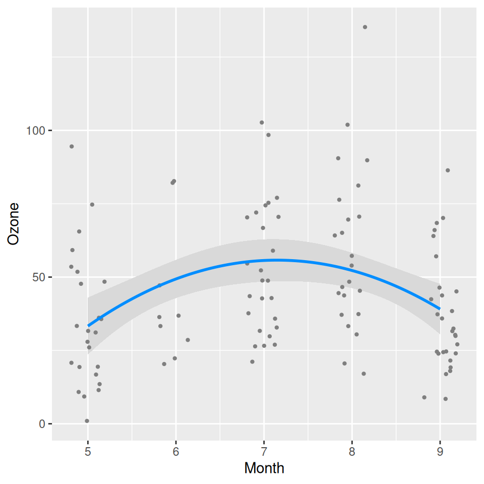

## Appearance of points, lines, and bands

Specifying `col='red'` won’t work, because `visreg` can’t know whether
you’re trying to change the color of the line, the band, or the points.
These options must be specified through separate parameter lists:

- `line`: Controls the appearance of the fitted line
- `fill`: Controls the appearance of the confidence band
- `points`: Controls the appearance of the partial residuals

Each of these is passed along to the underlying `ggplot2` geom
(`geom_line`/`geom_ribbon`/`geom_point` for a continuous `x`, or
`geom_errorbar`/`geom_tile`/`geom_jitter` for a factor `x`), so any
parameter that geom accepts can be specified:

``` r

visreg(fit, "Wind",
  line = list(color = "red"),
  fill = list(fill = "green"),
  points = list(size = 1.5, shape = 1)
)
```

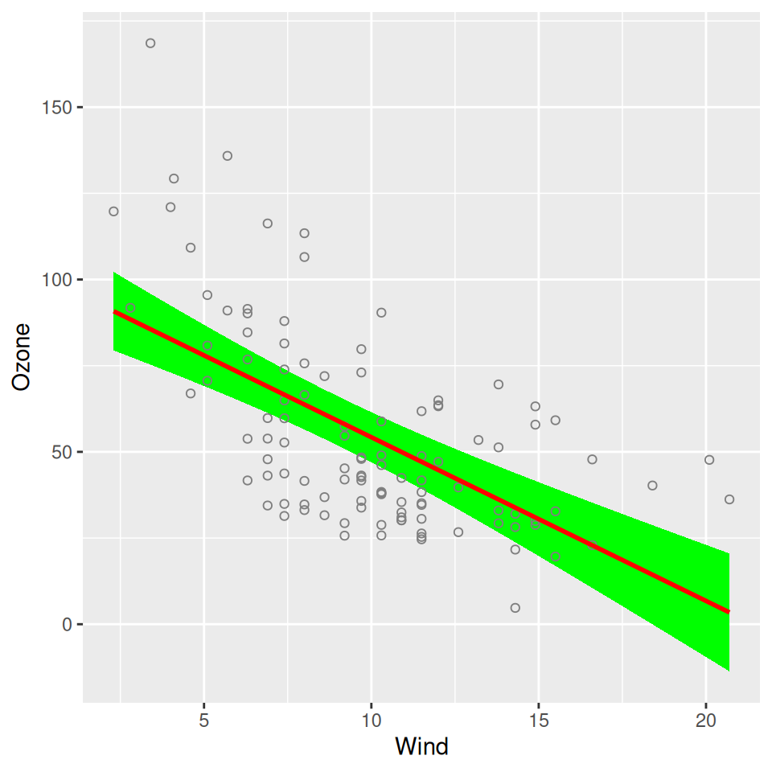

## Generic plot options

`visreg` returns a `gg` object, so its appearance can be customized just
like any other `ggplot2` plot, by adding further components. Here’s an
example that adds a title and re-labels the (log-transformed) y-axis:

``` r

fit <- lm(log(Ozone) ~ Solar.R + Wind + Temp, data = airquality)
at <- seq(1.5, 5, 0.5)
visreg(fit, "Wind", ylab = "Ozone") +
  ggtitle("Ozone is bad for you") +
  scale_y_continuous(breaks = at, labels = round(exp(at), 1))
```

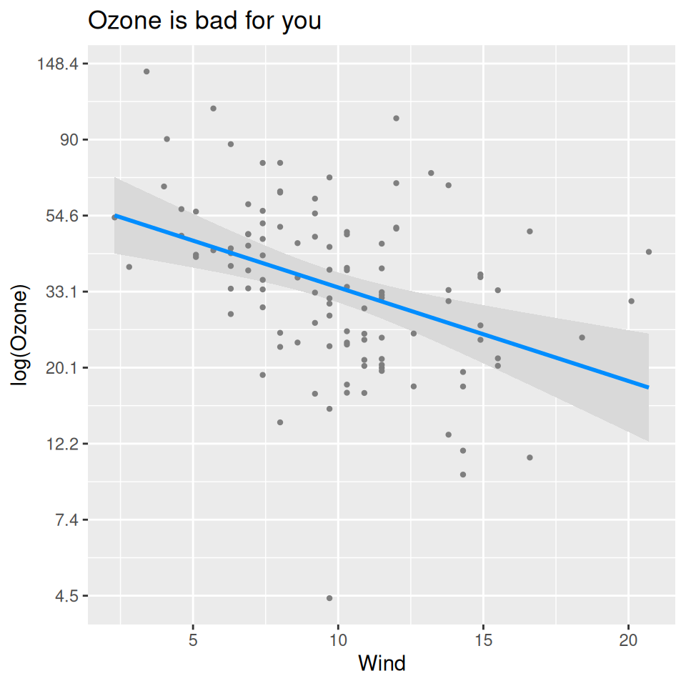

## Band width for factors

When `x` is a factor, the width of the confidence band (and its
accompanying line) is controlled through the `fill`/`line` arguments’
`width` parameter:

``` r

fit <- lm(Ozone ~ Solar.R + Wind + Heat, data = airquality)
visreg(fit, "Heat", fill = list(width = .9))
```

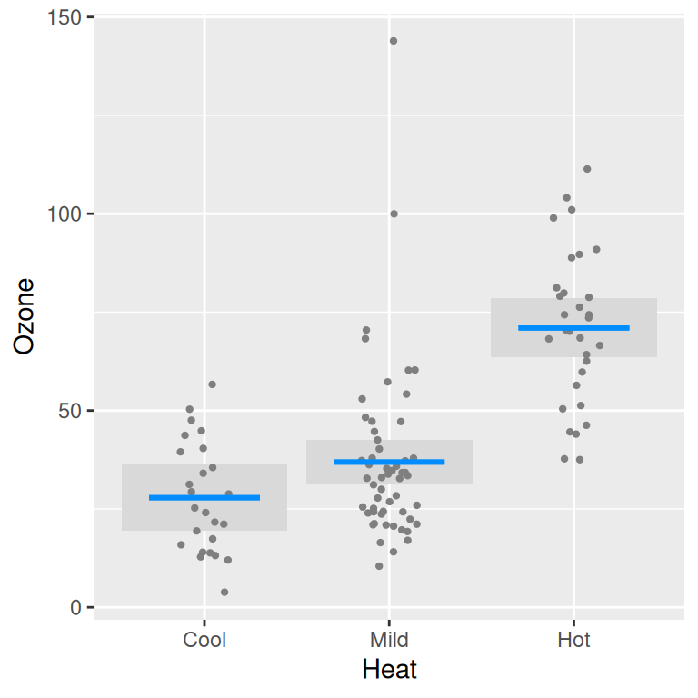

``` r

visreg(fit, "Heat", fill = list(width = .1))
```

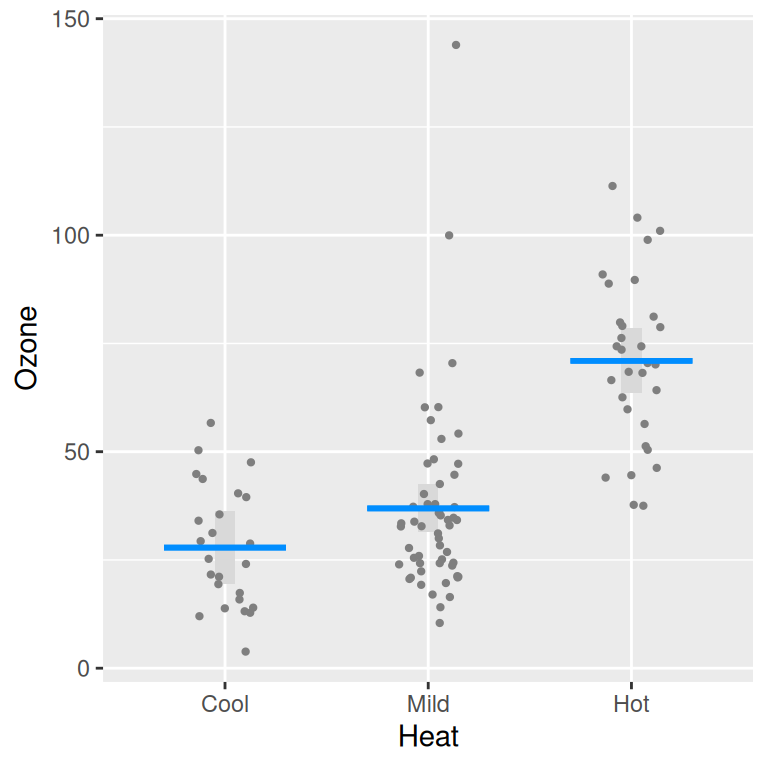

## Subsetting the plot

Occasionally, you might want to plot only a subset of the levels or
observations; you can use `subset` to accomplish this:

``` r

v <- visreg(fit, "Wind", by = "Heat", plot = FALSE)
v1 <- subset(v, Heat %in% c("Cool", "Hot"))
plot(v1)
```

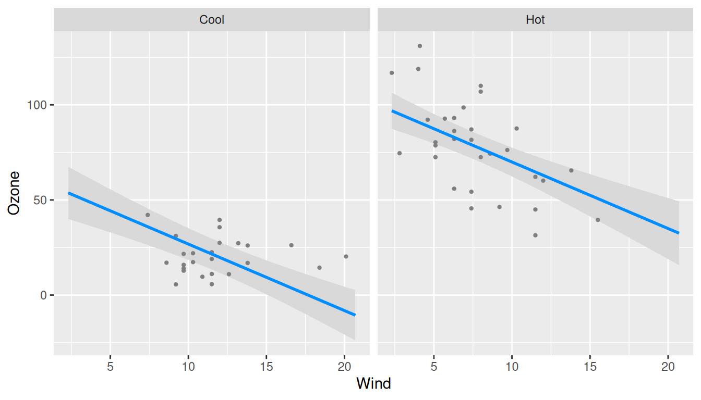

``` r

v2 <- subset(v, Wind < 15)
plot(v2)
```

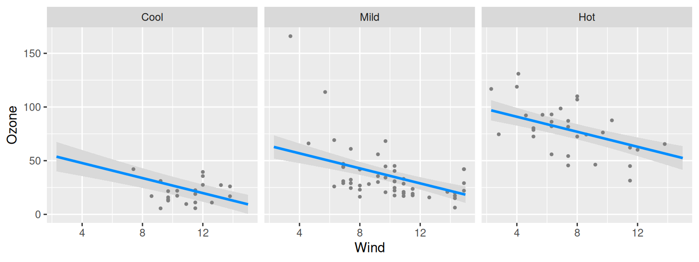
