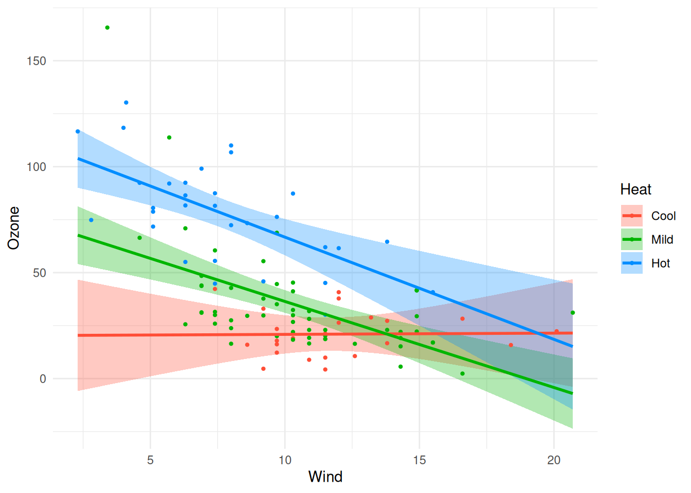
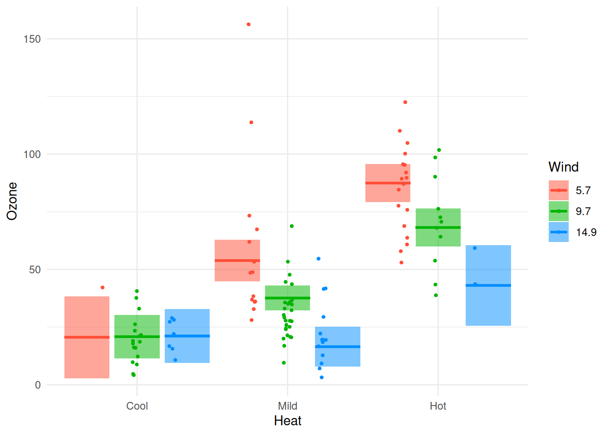
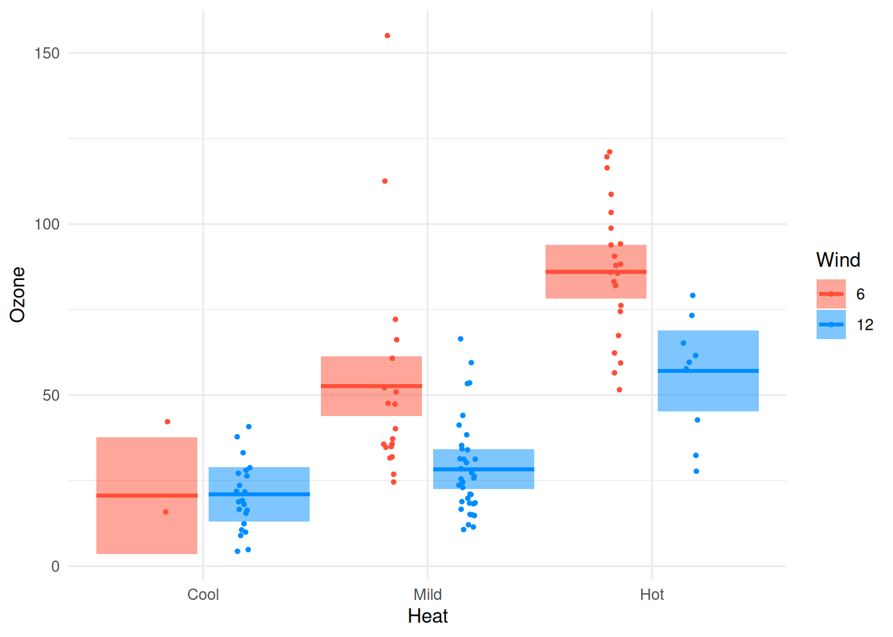
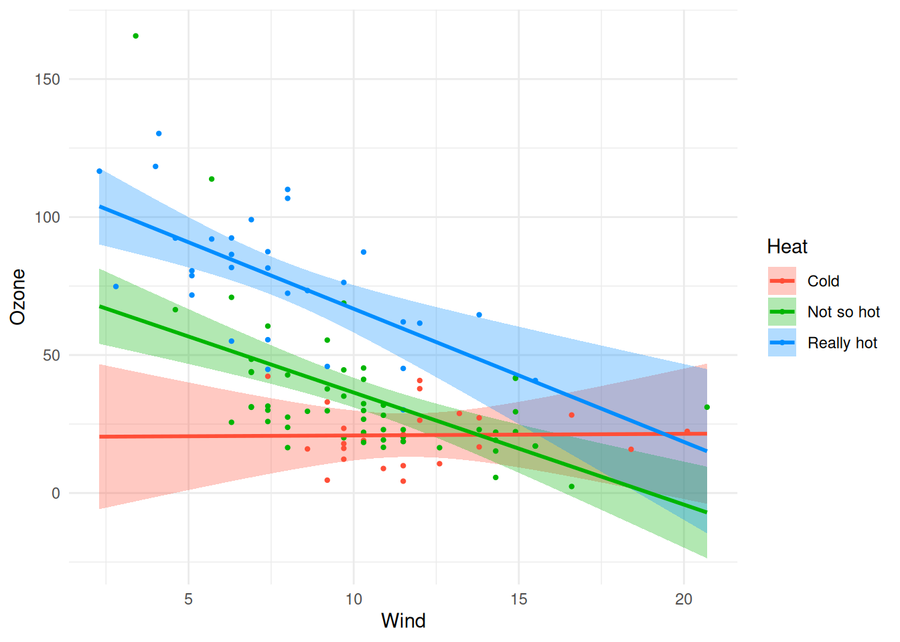
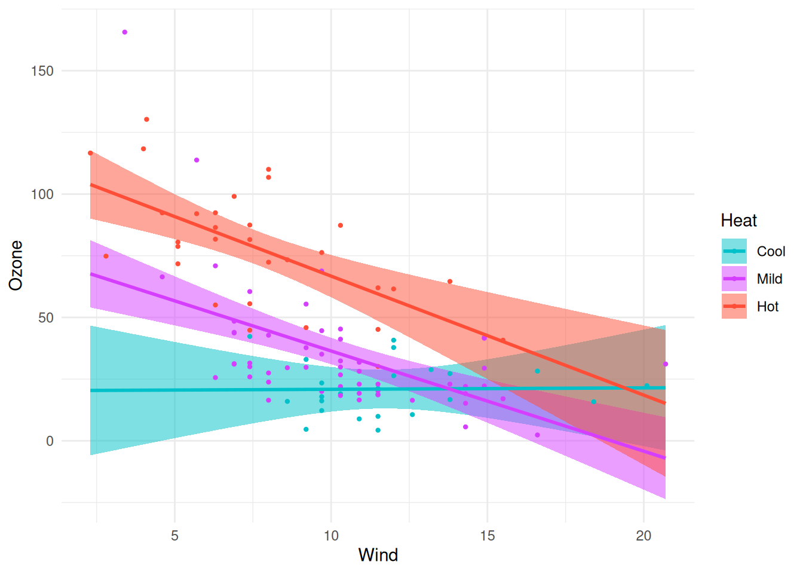

# Overlay plots

The default [cross-sectional
plot](https://pbreheny.github.io/visreg/articles/cross.md) places the
different cross-sections in separate panels. Occasionally, it is more
helpful to overlay the plots on top of one another to see more directly
how they compare. Using the same model as
[before](https://pbreheny.github.io/visreg/articles/cross.md):

``` r

airquality$Heat <- cut(airquality$Temp, 3, labels = c("Cool", "Mild", "Hot"))
fit <- lm(Ozone ~ Solar.R + Wind * Heat, data = airquality)
```

We can specify `overlay=TRUE` to obtain a version of the plot in which
all the images are overlaid:

``` r

visreg(fit, "Wind", by = "Heat", overlay = TRUE)
```



``` r

visreg(fit, "Heat", by = "Wind", overlay = TRUE)
```



The options described in [cross-sectional
plots](https://pbreheny.github.io/visreg/articles/cross.md) work in the
same way here. For example,

``` r

visreg(fit, "Heat", by = "Wind", overlay = TRUE, breaks = c(6, 12))
```



In particular, the option `strip_names` is used in the same way for
consistency, even though there are no actual strips in an overlay plot:

``` r

visreg(fit, "Wind", by = "Heat", overlay = TRUE, strip_names = c("Cold", "Not so hot", "Really hot"))
```



Changing the appearance of lines and points that are common to all
levels of `by` is accomplished in the same manner as [other `visreg`
plots](https://pbreheny.github.io/visreg/articles/options.md):

``` r

visreg(fit, "Wind", by = "Heat", overlay = TRUE, line = list(linewidth = 1))
```


Since the colors of the lines, points, and bands in an overlay plot are
mapped to the levels of `by`, changing them level-by-level is done the
usual `ggplot2` way, by adding a scale to the returned plot:

``` r

visreg(fit, "Wind", by = "Heat", overlay = TRUE) +
  scale_color_manual(values = c("#00C1C9", "#D63EFF", "#FF4E37")) +
  scale_fill_manual(values = c("#00C1C980", "#D63EFF80", "#FF4E3780"))
```


